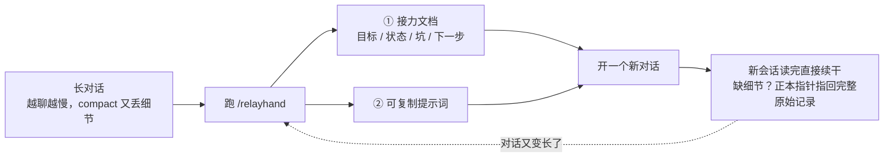
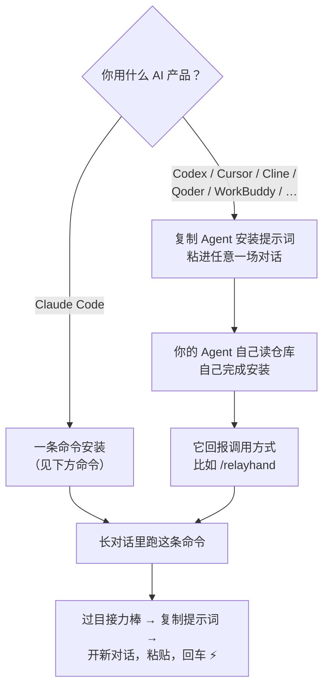
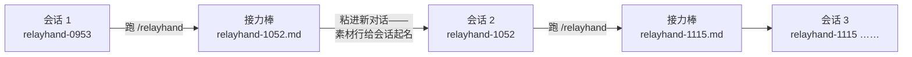

# relayhand —— 会话接力命令

[English](README.md) | **简体中文**

[](LICENSE)

把一场长对话压缩成一份面向"下一棒"的**接力文档** + **可复制提示词**，新对话粘贴即续——跨 AI 产品通用。

## 它解决什么问题

对话很长之后，原地压缩（各家 AI 的 compact 类功能）有两个硬伤：

- 压缩后的上下文依然不小——还是慢
- 压缩即丢失——细节没了就没了

relayhand 换个思路：**换会话，不压会话**。

## 为什么"换"优于"压"

| | 原地压缩 compact | 直接重开原始记录 | **relayhand** |
|---|---|---|---|
| 新会话携带的上下文 | 压缩摘要，依然不小 | 全部对话 | 干净上下文里的一根按任务裁剪的接力棒 |
| 细节 | 有损——丢了就丢了 | 完整但被淹没 | 完整——正本指针随棒附带 |
| 起步成本 | 还是慢 | 重 | 极小 |

## 它是怎么工作的（30 秒看懂）



三个关键做法：

1. **摘要进新会话**——新对话上下文干净，快
2. **正本不丢**——接力文档里写着完整对话记录（.jsonl）的路径，缺细节时新会话自己去搜原文（借鉴 Cline 的 sidecar 理念）
3. **任务即过滤器**——接力时可以指定下一棒任务，文档只总结该任务需要知道的内容，不做泛泛的全文摘要

## 安装与使用



**Claude Code**——一条命令装好（Windows 用 PowerShell 版）：

```bash
mkdir -p ~/.claude/commands && curl -fsSL https://raw.githubusercontent.com/yanlin-cheng/relayhand/main/claude-code/relayhand.md -o ~/.claude/commands/relayhand.md
```

```powershell
# Windows PowerShell
New-Item -ItemType Directory -Force "$env:USERPROFILE\.claude\commands" | Out-Null
irm https://raw.githubusercontent.com/yanlin-cheng/relayhand/main/claude-code/relayhand.md -OutFile "$env:USERPROFILE\.claude\commands\relayhand.md"
```

**其他 Agent 产品——Codex、Cursor、Cline、Qoder、WorkBuddy 或任何其他产品。** 别复制提示词本身，让 Agent 自己动手装。把下面的块复制进该产品的**任意一场对话**（仅此一次），Agent 会自己读仓库、自己完成安装：

```text
帮我安装 "relayhand" 会话接力命令。
1. 打开 https://github.com/yanlin-cheng/relayhand 并阅读 universal/relayhand.md——
   它是一个会话交接命令的通用核心提示词，不绑定任何产品。
2. 在你自己的产品里找到最接近"自定义命令"的机制（自定义提示词/命令文件、规则、
   工作流均可——以你自己的文档为准，确定该放在哪）。
3. 把核心提示词以 "relayhand" 之名安装进去，模板与写作纪律保持原样；
   标注为 Claude Code 专属增强的段落可以删去。
4. 这是一次性安装：之后我在对话变长时随时调用它。请告诉我确切的调用方式，
   以及你安装时发现的任何限制。
5. 如果你所在的产品完全没有自定义命令机制，直说，并把仓库里的"逐次粘贴"
   使用说明拿给我。
```

装完就结束了——**一次安装，长期使用**。之后每次交接都只是跑一条命令（如 `/relayhand`），不再需要复制粘贴任何东西。

想手动安装，或想看单产品说明？见 [adapters/cline.md](adapters/cline.md) 与 [adapters/cursor.md](adapters/cursor.md)。所在环境完全无法联网？打开 [universal/relayhand.md](universal/relayhand.md)，把分隔线以下整段复制进想交接的对话发送。

### 怎么用——一条命令，两种玩法

装好之后，relayhand 就是一条命令：对话变长时跑一下——

```
/relayhand
```

它会把当前对话提炼成一份交给下一个会话的接力文档。真正好用的是这一步：**告诉它下一个会话要干什么**——

```
/relayhand 重构登录模块
```

这时整份接力文档都会**围绕这个任务来写**：只提炼该任务需要的背景、决策、文件和坑，并把下一步写成具体到可直接执行的清单——新会话一粘贴就开始干活。同一场对话，参数不同，交出的接力棒就不同。

还有一个变体：

```
/relayhand 跨产品   # 额外输出一份自包含的内嵌提示词，可粘进其他 AI 产品
```

> **一份模板，全语言通用。** 模板指令是英文（提示词的通用语），但接力文档本身跟随你当前对话的语言——中文对话就产出中文接力文档，不用选版本装。

## 一根接力棒里有什么

接力文档不是聊天回顾，是一份交给下一个 agent 的任务交接单：

```text
# 接力：<一句话点明任务>
## 目标        ← 一句话：在构建/修复什么，为什么
## 状态        ← 已完成 / 进行中 / 受阻
## 关键决策    ← 影响后续工作的技术选择及原因
## 坑（勿重蹈）  ← 失败尝试+原因；排障结论：症状→根因→解法
## 下一步      ← 立即可执行的动作，具体到可直接跑   ★ 唯一的详细区
## 文件        ← 读过 / 改过（从对话中真实提取）
## 正本        ← 完整对话记录路径，缺细节就 Grep 它
```

四条设计理念：

| 理念 | 一句话解释 |
|---|---|
| **整体克制，唯独下一步要详细** | 模板按状态组织、不按时间组织——想写"对话过程叙事"都没有格子放 |
| **任务即过滤器** | `/relayhand 重构登录模块` 时，任务决定文档收录什么，无关内容再重要也不写 |
| **正本永不丢** | 摘要归摘要，原始记录一个字不动，指针写进文档 |
| **源自真实源码** | 模板骨架和总纲抄自 Cline 压缩器的真实源码指令，不是凭感觉写的 |

## 精工细节

接力链全程可追溯：每根接力棒的时间戳就是下一个会话的名字，会话列表排成一条接力队列。



小机制，大作用：

| 细节 | 干什么用 |
|---|---|
| **命名素材** | 提示词首行 `接力 relayhand-<时间戳> —— <任务一句话>`，把新会话的自动标题引到接力链上（代码块下附一行 `/rename` 说明，可选，但精确） |
| **先对账再动手** | 提示词要求新会话先跑 `git status`——仓库现实若跑在了文档前面，先对齐再干活 |
| **禁复述** | 新会话默读接力文档即可——复述一遍是纯 token 浪费 |
| **原话逐字保护** | 你的最新指令逐字引用，绝不被"消化"成总结者的转述 |
| **未提交也算改过** | 文件栏连工作区未 commit 的改动一并报告，不只盯提交 |
| **脱敏内建** | API key、密码、个人信息不进接力文档 |
| **自检更新** | 运行时可将本地已装副本与仓库比对；发现新版本先询问用户，更新在下次运行生效——绝不在运行中途换指令，离线则静默跳过 |

## 源自源码，交叉验证

- 接力棒骨架与"整体克制，唯独下一步要详细"的总纲抄自 **Cline 压缩器的真实源码指令**（agentic-compaction.ts、compaction-shared.ts）
- **坑栏成为一等公民**是三个独立交接类项目不约而同的选择——三家互不知情的作者做出同一个设计，比任何单方论证都硬
- 禁复述、原话逐字保护等微行为，对应 Claude Code 给自家压缩器修过的同类问题

完整设计推演与决策日志见 [DESIGN.md](DESIGN.md)。

## 参与贡献

本仓库是 relayhand 的唯一源头，欢迎 issue / PR 反馈模板与纪律的改进。核心原则：**整体克制，唯独下一步要详细**。

## 许可

[MIT](LICENSE)
