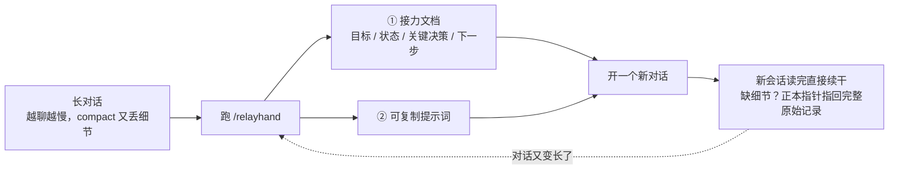
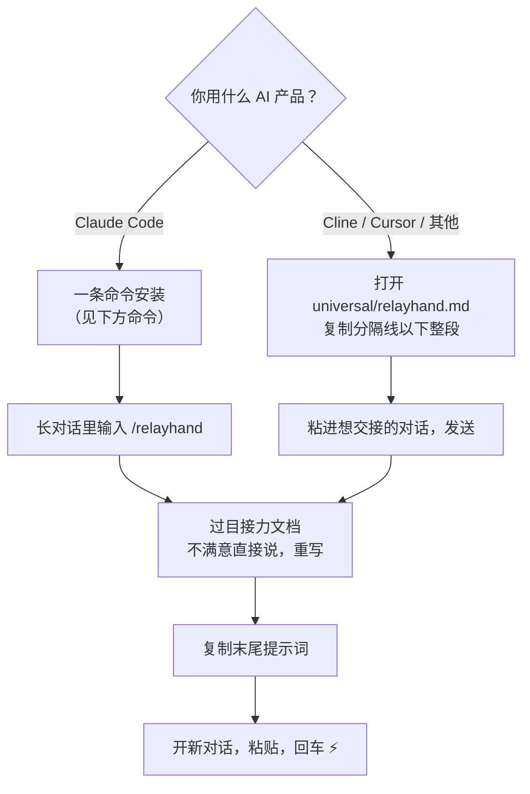

# relayhand —— 会话接力命令

[English](README.md) | **简体中文**

把一场长对话压缩成一份面向"下一棒"的**接力文档** + **可复制提示词**，新对话粘贴即续——跨 AI 产品通用。

## 它解决什么问题

对话很长之后，原地压缩（各家 AI 的 compact 类功能）有两个硬伤：

- 压缩后的上下文依然不小——还是慢
- 压缩即丢失——细节没了就没了

relayhand 换个思路：**换会话，不压会话**。

## 它是怎么工作的（30 秒看懂）



三个关键做法：

1. **摘要进新会话**——新对话上下文干净，快
2. **正本不丢**——接力文档里写着完整对话记录（.jsonl）的路径，缺细节时新会话自己去搜原文（借鉴 Cline 的 sidecar 理念）
3. **任务即过滤器**——接力时可以指定下一棒任务，文档只总结该任务需要知道的内容，不做泛泛的全文摘要

## 一根接力棒里有什么

接力文档不是聊天回顾，是一份交给下一个 agent 的任务交接单：

```text
# 接力：<一句话点明任务>
## 目标        ← 一句话：在构建/修复什么，为什么
## 状态        ← 已完成 / 进行中 / 受阻
## 关键决策    ← 影响后续工作的技术选择及原因
## 下一步      ← 立即可执行的动作，具体到可直接跑   ★ 唯一的详细区
## 文件        ← 读过 / 改过（从对话中真实提取）
## 正本        ← 完整对话记录路径，缺细节就 Grep 它
```

四条设计理念：

| 理念 | 一句话解释 |
|---|---|
| **整体克制，唯独下一步要详细** | 模板按状态组织、不按时间组织——想写"对话过程叙事"都没有格子放 |
| **任务即过滤器** | `/relayhand 重构登录模块` 时，任务决定文档收录什么，无关内容再重要也不写 |
| **正本永不丢** | 摘要归摘要，原始记录一个字不动，指针写进文档 |
| **源自真实源码** | 模板骨架和总纲抄自 Cline 压缩器的真实源码指令，不是凭感觉写的 |

## 安装与使用



**Claude Code**——一条命令装好（Windows 用 PowerShell 版）：

```bash
mkdir -p ~/.claude/commands && curl -fsSL https://raw.githubusercontent.com/yanlin-cheng/relayhand/main/claude-code/relayhand.md -o ~/.claude/commands/relayhand.md
```

```powershell
# Windows PowerShell
New-Item -ItemType Directory -Force "$env:USERPROFILE\.claude\commands" | Out-Null
irm https://raw.githubusercontent.com/yanlin-cheng/relayhand/main/claude-code/relayhand.md -OutFile "$env:USERPROFILE\.claude\commands\relayhand.md"
```

**其他产品**——不用命令功能，打开文件复制粘贴即可：

| 你用什么 | 拿法 |
|---|---|
| Cline | 见 [adapters/cline.md](adapters/cline.md) |
| Cursor | 见 [adapters/cursor.md](adapters/cursor.md) |
| 其他任何 AI 产品 | 打开 [universal/relayhand.md](universal/relayhand.md)，把分隔线以下整段复制进想交接的对话发送 |

> **一份模板，全语言通用。** 模板指令是英文（提示词的通用语），但接力文档本身跟随你当前对话的语言——中文对话就产出中文接力文档，不用选版本装。

## 用法示例（Claude Code 版）

```
/relayhand                    # 通用总结：整场对话该知道的都提炼
/relayhand 重构登录模块        # 任务定制：只捞该任务需要的背景/决策/文件/坑
/relayhand 跨产品             # 额外输出可粘进其他 AI 产品的内嵌版提示词
```

## 设计依据

模板不是凭感觉写的——骨架和"整体克制，唯独下一步要详细"的总纲抄自 **Cline 压缩器的真实源码指令**，设计推演与决策日志见 [DESIGN.md](DESIGN.md)。

## 参与贡献

本仓库是 relayhand 的唯一源头，欢迎 issue / PR 反馈模板与纪律的改进。核心原则：**整体克制，唯独下一步要详细**。

## 许可

[MIT](LICENSE)
