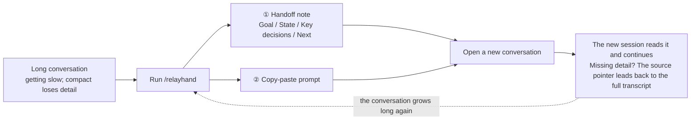
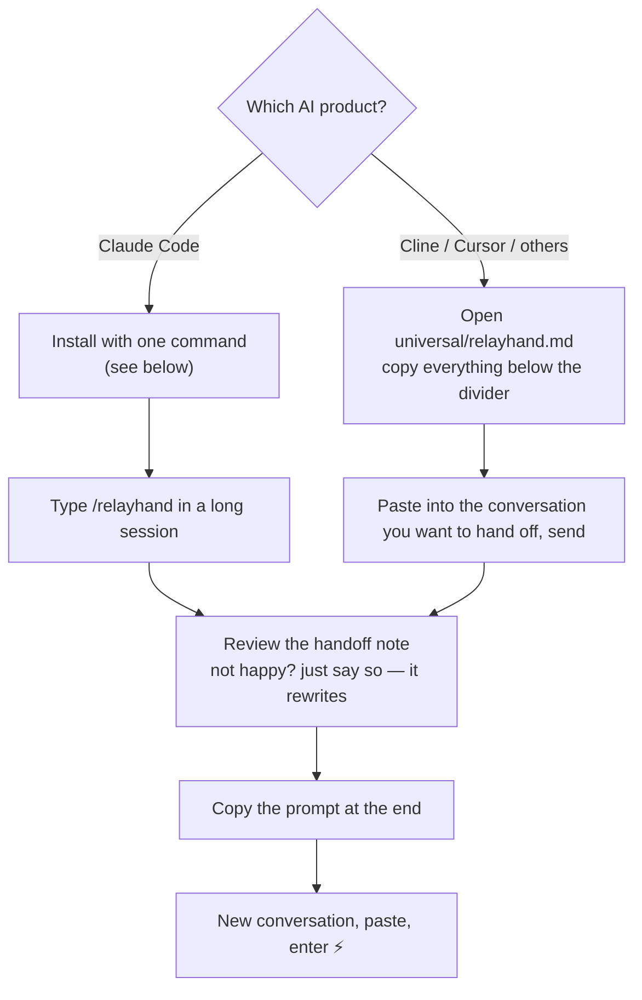

# relayhand — Session Relay Command

**English** | [简体中文](README-ZH.md)

relayhand turns a long AI coding session into a **handoff note** + a **copy-paste prompt**, so a fresh conversation picks up right where you left off — in any AI product.

## The problem it solves

Once a conversation runs long, in-place compaction (the `compact`-style features in today's AI tools) hits two hard limits:

- The compacted context is still large — still slow
- Compaction loses detail — once gone, gone for good

relayhand takes a different route: **switch sessions, don't compress the session**.

## How it works (30 seconds)



Three key moves:

1. **The summary goes into a fresh session** — clean context, fast
2. **The source of truth is never lost** — the note carries the path of the full conversation transcript (.jsonl); when detail is missing, the new session greps the original (inspired by Cline's sidecar idea)
3. **The task is the filter** — you can name the next leg's task at handoff time; the note then covers only what that task needs, instead of a generic everything-summary

## What's inside the baton

The handoff note is not a chat recap — it is a task handoff sheet written for the next agent:

```text
# Handoff: <one sentence naming the task>
## Goal            ← one sentence: what is being built/fixed, and why
## State           ← done / in progress / blocked
## Key decisions   ← technical choices that affect later work, and why
## Next            ← immediately executable actions        ★ the only detailed section
## Files           ← read / edited (extracted from the real conversation)
## Source of truth ← path to the full transcript; grep it when detail is missing
```

Four design principles:

| Principle | In one sentence |
|---|---|
| **Restrained throughout, detailed only about the next step** | The template is organized by state, not by time — there is literally no slot for "here's what we discussed" storytelling |
| **The task is the filter** | With `/relayhand refactor the login module`, the task decides what the note contains; however important, unrelated content stays out |
| **The source of truth is never lost** | Summarize freely — the original transcript is untouched, and its pointer is written into the note |
| **Born from real source code** | The template skeleton and the doctrine come from the actual compactor instructions in Cline's source — not from vibes |

## Install & use



**Claude Code** — one command to install (Windows users: the PowerShell version):

```bash
mkdir -p ~/.claude/commands && curl -fsSL https://raw.githubusercontent.com/yanlin-cheng/relayhand/main/claude-code/relayhand.md -o ~/.claude/commands/relayhand.md
```

```powershell
# Windows PowerShell
New-Item -ItemType Directory -Force "$env:USERPROFILE\.claude\commands" | Out-Null
irm https://raw.githubusercontent.com/yanlin-cheng/relayhand/main/claude-code/relayhand.md -OutFile "$env:USERPROFILE\.claude\commands\relayhand.md"
```

**Other products** — no custom-command feature needed; open the file and copy-paste:

| What you use | How to get it |
|---|---|
| Cline | see [adapters/cline.md](adapters/cline.md) |
| Cursor | see [adapters/cursor.md](adapters/cursor.md) |
| Any other AI product | open [universal/relayhand.md](universal/relayhand.md), copy everything below the divider into the conversation you want to hand off |

> **One template, every language.** The command's instructions are in English (the lingua franca of prompts), but the handoff note itself is written in whatever language your conversation uses — Chinese conversation, Chinese handoff note. No need to pick a version.

## Usage examples (Claude Code)

```
/relayhand                        # general summary: everything the next leg should know
/relayhand refactor login module  # task-tailored: only the context/decisions/files/pitfalls that task needs
/relayhand cross-product          # additionally output the embedded prompt for other AI products
```

## Design rationale

The template wasn't written on instinct — the skeleton and the doctrine of **"restrained throughout, detailed only about the next step"** are taken from the **actual compactor instructions in Cline's source code**. The design reasoning and decision log live in [DESIGN.md](DESIGN.md).

## Contributing

This repository is the single source of truth for relayhand. Issues and PRs on the template and its discipline are welcome. The core principle: **restrained throughout, detailed only about the next step**.

## License

[MIT](LICENSE)
