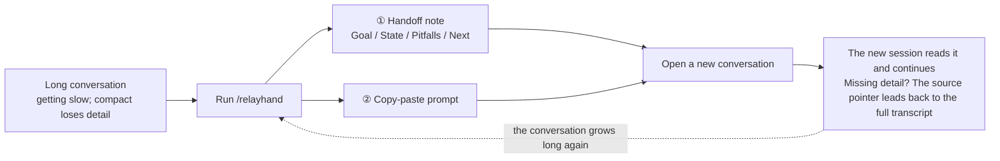
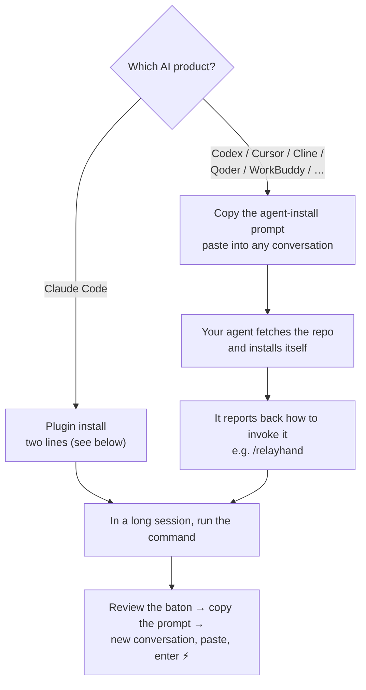
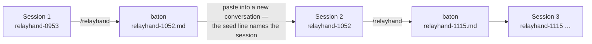

# relayhand — Session Relay Command

**English** | [简体中文](README-ZH.md)

[](LICENSE)

relayhand turns a long AI coding session into a **handoff note** + a **copy-paste prompt**, so a fresh conversation picks up right where you left off — in any AI product.

## The problem it solves

Once a conversation runs long, in-place compaction (the `compact`-style features in today's AI tools) hits two hard limits:

- The compacted context is still large — still slow
- Compaction loses detail — once gone, gone for good

relayhand takes a different route: **switch sessions, don't compress the session**.

## Why switching beats compressing

| | In-place compact | Reopen the raw transcript | **relayhand** |
|---|---|---|---|
| Context the next session carries | compressed summary, still large | everything | a task-shaped baton in a clean context |
| Detail | lossy — once gone, gone | intact but buried | intact — the source pointer rides along |
| Start-up cost | still slow | heavy | minimal |

## When NOT to use relayhand

relayhand is for handing work **out of the current session**. Other situations have better tools:

- **Same task, same session, just getting heavy** → `/compact`. In-place compression is the right call; switching sessions is overkill.
- **Task is done or throwaway** → just open a new conversation (`/clear`). Nothing worth handing off.
- **The work must survive this session — or move to another AI product** → that's relayhand's job.

## How it works (30 seconds)

## How it works (30 seconds)



Three key moves:

1. **The summary goes into a fresh session** — clean context, fast
2. **The source of truth is never lost** — the note carries the path of the full conversation transcript (.jsonl); when detail is missing, the new session greps the original (inspired by Cline's sidecar idea)
3. **The task is the filter** — you can name the next leg's task at handoff time; the note then covers only what that task needs, instead of a generic everything-summary

## Install & use



**Claude Code** — install as a plugin (in a Claude Code session, run):

```
/plugin marketplace add yanlin-cheng/relayhand
/plugin install relayhand@yanlin-cheng
```

That's it — the command ships as a plugin, so it updates through the plugin system on its own; run `/relayhand` in any session.

Prefer a plain file, or on an older version without plugin support? One command still works (Windows users: the PowerShell version):

```bash
mkdir -p ~/.claude/commands && curl -fsSL https://raw.githubusercontent.com/yanlin-cheng/relayhand/main/commands/relayhand.md -o ~/.claude/commands/relayhand.md
```

```powershell
# Windows PowerShell
New-Item -ItemType Directory -Force "$env:USERPROFILE\.claude\commands" | Out-Null
irm https://raw.githubusercontent.com/yanlin-cheng/relayhand/main/commands/relayhand.md -OutFile "$env:USERPROFILE\.claude\commands\relayhand.md"
```

**Any other agent product — Codex, Cursor, Cline, Qoder, WorkBuddy, or anything else.** Don't copy-paste the prompt itself; let your agent do the install. Copy the block below into any conversation of that product **once** — the agent reads this repo and sets itself up:

```text
Install the "relayhand" session-relay command for me.
1. Fetch https://github.com/yanlin-cheng/relayhand and read universal/relayhand.md —
   the product-agnostic core prompt of a session handoff command.
2. Find the closest thing to custom commands in your own product (a custom prompt /
   command file, a rule, a workflow — check your own docs for the right place).
3. Install that core prompt there under the name "relayhand", keeping its template
   and writing discipline intact. Sections marked as Claude-Code-only enhancements
   may be dropped.
4. One-time install: afterwards I will invoke it whenever a conversation runs long.
   Tell me the exact invocation and any limitations you found.
5. If your product has no custom-command mechanism at all, say so and instead give
   me the paste-in-per-session instructions from the repo.
```

That's it — **install once**. From then on, every handoff is just running the command (e.g. `/relayhand`), never re-pasting anything.

Prefer manual setup, or want per-product notes? See [adapters/cline.md](adapters/cline.md) and [adapters/cursor.md](adapters/cursor.md). No web access at all? Open [universal/relayhand.md](universal/relayhand.md) and copy everything below the divider into the conversation you want to hand off.

### How to use — one command, two modes

Once installed, relayhand is just a command you run when a conversation gets long:

```
/relayhand
```

It distills the current conversation into a handoff note for the next session. The real power: **tell it what the next session should do** —

```
/relayhand refactor the login module
```

Now the whole note is written **around that task**: only the context, decisions, files, and pitfalls the task needs — and the next steps laid out as concrete, immediately executable actions, so the new session starts working the moment you paste. Same conversation, different argument → a different baton.

One more variant:

```
/relayhand cross-product   # additionally output an embedded, self-contained prompt for other AI products
```

> **One template, every language.** The command's instructions are in English (the lingua franca of prompts), but the handoff note itself is written in whatever language your conversation uses — Chinese conversation, Chinese handoff note. No need to pick a version.

## What's inside the baton

The handoff note is not a chat recap — it is a task handoff sheet written for the next agent:

```text
# Handoff: <one sentence naming the task>
## Goal            ← one sentence: what is being built/fixed, and why
## State           ← done / in progress / blocked
## Key decisions   ← technical choices that affect later work, and why
## Pitfalls        ← failed attempts + why; debugging: symptom → root cause → fix
## Suggested skills ← skills the next leg should invoke (Claude Code version)
## Next            ← immediately executable actions        ★ the only detailed section
## Files           ← read / edited (extracted from the real conversation)
## Source of truth ← path to the full transcript; grep it when detail is missing
```

Four design principles:

| Principle | In one sentence |
|---|---|
| **Restrained throughout, detailed only about the next step** | The template is organized by state, not by time — there is literally no slot for "here's what we discussed" storytelling |
| **The task is the filter** | With `/relayhand refactor the login module`, the task decides what the note contains; however important, unrelated content stays out |
| **The source of truth is never lost** | Summarize freely — the original transcript is untouched, and its pointer is written into the note |
| **Born from real source code** | The template skeleton and the doctrine come from the actual compactor instructions in Cline's source — not from vibes |

## Engineered details

The relay chain stays traceable: each baton's timestamp becomes the next session's name, so your session list lines up like a relay race.



Small mechanisms that add up:

| Detail | What it does |
|---|---|
| **Naming seed** | The prompt's first line `Relay relayhand-<timestamp> — <task>` steers the new session's auto-title onto the relay chain (an optional `/rename` note below the block pins it exactly) |
| **Reconcile before acting** | The prompt makes the new session run `git status` first — if the repo moved past the note, align before working |
| **No recap** | The new session reads the note silently — reciting it back is pure token waste |
| **Verbatim protection** | Your latest instruction is quoted word-for-word, never paraphrased into the summarizer's interpretation |
| **Uncommitted counts as edited** | The Files section reports working-tree changes too, not just commits |
| **Redaction built in** | API keys, passwords, and personal information never enter the note |
| **Self-update check** | File installs may diff the installed copy against the repo at run time; a newer version is offered to the user and takes effect on the next invocation — never mid-run, silently skipped offline. Plugin installs don't need it: the plugin system updates them |

## Born from source code, cross-checked

- The baton skeleton and the doctrine **"restrained throughout, detailed only about the next step"** are taken from the **actual compactor instructions in Cline's source** (`agentic-compaction.ts`, `compaction-shared.ts`)
- **Pitfalls as a first-class section** is a converged choice: three independent handoff projects made it without knowing about each other. Three strangers reaching the same design is stronger evidence than any single argument
- The micro-behaviors (no recap, verbatim protection) mirror the same fixes Claude Code shipped for its own compactor

Full design reasoning and the decision log: [DESIGN.md](DESIGN.md).

## Contributing

This repository is the single source of truth for relayhand. Issues and PRs on the template and its discipline are welcome. The core principle: **restrained throughout, detailed only about the next step**.

## License

[MIT](LICENSE)
